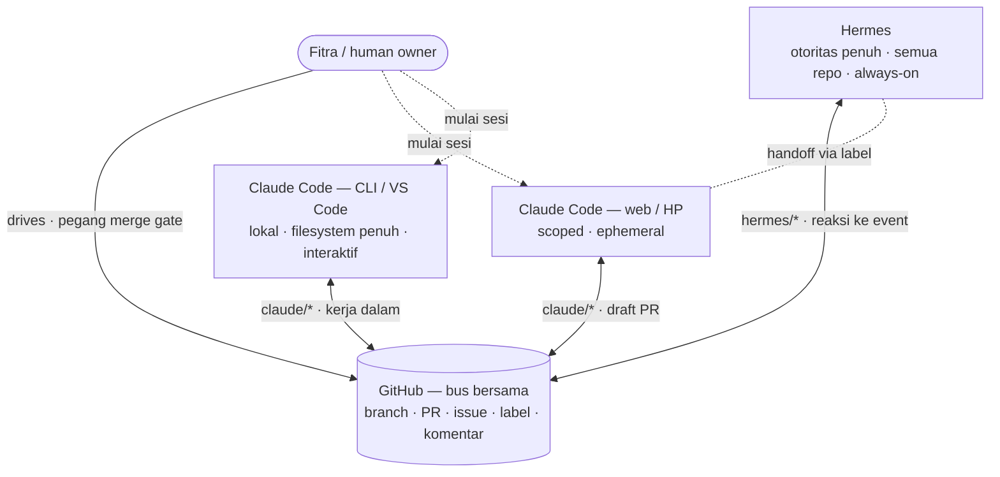

# Topologi Workspace

Siapa yang ada di mana, apa yang mengalir di antara mereka, dan surface mana yang
dipakai untuk apa. Pendamping `.agents/COLLABORATION.md` (aturan protokol); file ini
adalah *topologi*-nya.

**Ide inti:** GitHub adalah bus bersama — semua aktor baca/tulis lewat sana, tanpa
kanal samping. Config yang di-commit di repo (`CLAUDE.md`, `.claude/`, `.agents/`)
adalah "OS bersama" yang bikin semua surface Claude Code berperilaku identik dan
dibaca Hermes juga. Ubah sekali, semua mewarisi.

## Agents

| Agent | Branch Prefix | Identity | Peran |
|---|---|---|---|
| **Hermes** | `hermes/*` | `Hermes <hermes@epslab.id>` | DevOps, backend, infrastruktur, automation, data pipeline |
| **Claude Code** | `claude/*` | `Claude Code <claude@anthropic.com>` | Frontend, arsitektur, code review, refactor kompleks |

Claude Code dijangkau dari beberapa **surface** — semuanya produk sama, berbagi satu
config repo dan satu namespace branch `claude/*`, jadi dari sudut protokol mereka satu
kolaborator:

| Surface | Tempat jalan | Otoritas | Umur | Paling cocok untuk |
|---|---|---|---|---|
| **web / HP** | Sandbox cloud ephemeral | Scoped ke repo yang di-attach | Per-sesi | Mulai/review tugas saat mobile, fix cepat, monitoring PR |
| **CLI / VS Code** | Mesin lokalmu | Identitas GitHub-mu | Per-sesi (panjang) | Kerja dalam, debug, jalankan app, refactor besar dengan filesystem penuh |

Karena config dibagi, kamu bisa pindah di tengah tugas: mulai fix dari HP, lanjut di
VS Code — `CLAUDE.md`, command, dan branch yang sama. **PR-nya yang jadi kontinuitas,
bukan device-nya.**

## Repositories

Daftar repo dalam workspace kolaborasi:

| Repo | Visibility | Primary Agent | Catatan |
|---|---|---|---|
| `fitravertikal/skills` | public | Claude Code | Sumber kanonik untuk `.agents/`, skills, templates |
| `fitravertikal/edss` | private | — | Engineering Design Support System |
| `fitravertikal/epslab_server` | private | Hermes | EPSLAB server documentation & config |
| `fitravertikal/slr-engine` | private | — | Systematic Literature Review engine |
| `fitravertikal/Agent-Reach` | public | Hermes | Agent research & outreach tool |
| `fitravertikal/loki` | public | — | — |
| `fitravertikal/bibliometrix` | public | — | Bibliometric analysis |
| `fitravertikal/ssds` | private | — | — |
| `fitravertikal/ai-engineering-from-scratch` | public | — | AI engineering learning material |
| `fitravertikal/odoo` | public | — | Odoo ERP |
| `fitravertikal/hermes-mirror` | private | Hermes | Hermes config mirror/backup |
| `fitravertikal/office` | public | — | Office tools |

> Diperbarui saat repo ditambahkan/dihapus dari workspace.

## Gambaran

Hub-and-spoke, bukan mesh: agent tidak pernah bicara langsung. Hermes menyerahkan kerja
ke Claude Code (dan sebaliknya) dengan memindahkannya lewat GitHub — sebuah label,
assignee, draft PR. Itu yang bikin semuanya auditable dan anti-loop.

## Dua Plane

- **Data plane (yang bergerak):** branch, commit, PR, issue, label, komentar — semua
  durable di GitHub. Kalau intent tak diekspresikan sebagai salah satu ini, aktor lain
  tak bisa melihatnya.
- **Control plane (yang menentukan langkah berikut):** label (`needs:*`, `agent:*`) per
  `COLLABORATION.md`, dengan Fitra memegang merge gate akhir. Label di issue/PR **adalah**
  state baton saat ini.

## Branch Namespacing

| Pemilik | Prefix | Catatan |
|---|---|---|
| Hermes | `hermes/<tugas>` | Hanya commit di sini; tak pernah menyentuh `claude/*`. |
| Claude Code (surface mana pun) | `claude/<tugas>` | Payung bersama. Claude tak pernah menyentuh `hermes/*`. |

Kalau dua surface Claude Code jalan di repo yang sama bersamaan, bedakan per-tugas
(`claude/web-fix-auth`, `claude/cli-refactor-db`) supaya tak tabrakan di satu branch —
tapi tetap di bawah `claude/` agar aturan kepemilikan tetap berlaku.

## Contoh Tugas, End to End

1. **Fitra** (dari HP) buka issue #42, karena lintas dua service beri label `needs:hermes`, assign Hermes.
2. **Hermes** ambil (`needs:hermes` → `agent:wip`), kerjakan bagian lintas-repo di `hermes/fix-cache-42`, buka draft PR, lalu serahkan bagian app ke Claude: komentar (Done/Want/Context) + `needs:claude` + assign.
3. **Fitra** (nanti, di VS Code) jalankan Claude Code, yang ambil #42, kerjakan sisi app di `claude/fix-cache-42`, verifikasi dengan menjalankan app, tandai PR *ready*, label `agent:review` balik ke Hermes.
4. **Hermes** review PR, approve.
5. **Fitra** merge ke `main`. Issue tertutup.

Kalau langkah 2–4 bolak-balik 3× tanpa jadi *ready*, yang memegang menambah `agent:blocked` dan berhenti untuk Fitra — tidak ada loop tak berujung.

## Yang Sync vs Lokal

| Di repo (sync ke semua surface + Hermes) | Per-device (tidak sync) |
|---|---|
| `CLAUDE.md`, `.claude/settings.json`, `.claude/hooks/`, `.claude/commands/`, `.claude/agents/`, `.agents/*` | `~/.claude/CLAUDE.md`, `~/.claude/settings.json`, `.claude/settings.local.json` |

Patokan: kalau perilaku harus berlaku di mana-mana, commit ke repo. Kalau itu preferensi
pribadimu di satu mesin, simpan di `~/.claude`.
