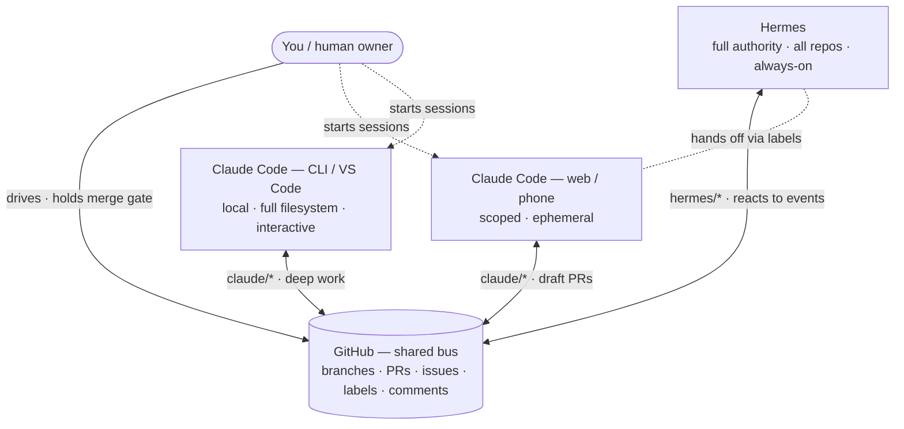

# Workspace Topology

How the actors fit together and why. The companion to `.agents/COLLABORATION.md`:
that file is the *protocol* (rules of the handoff), this file is the *topology*
(who sits where, what flows between them, and which surface to reach for).

**One idea underneath everything:** GitHub is the shared bus. Every actor reads
and writes through it — no side channels. And the repo's committed config
(`CLAUDE.md`, `.claude/`, `.agents/`) is the shared "operating system" that makes
every Claude Code surface behave identically and that Hermes reads too. Change it
once, everyone inherits it.

---

## Actors and tiers

| Actor | Where it runs | GitHub authority | Lifespan | Best at |
|---|---|---|---|---|
| **You (human)** | Everywhere | Owner | — | Deciding, arbitrating, holding the merge gate |
| **Hermes** | Its own always-on host | Full, all repos | Persistent | Cross-repo orchestration, reacting to events 24/7, bulk/scheduled ops |
| **Claude Code — web / phone** | Ephemeral cloud sandbox | Scoped to attached repos | Per session | Kicking off & reviewing on the go, quick fixes, monitoring PRs |
| **Claude Code — CLI / VS Code** | Your local machine | Your GitHub identity | Per session (long) | Deep work, debugging, running the app, big refactors with full filesystem |

The three Claude Code rows are the **same product on different surfaces**. They
share one repo config and one branch namespace (`claude/*`), so from the
protocol's point of view they are a single collaborator — "Claude Code" — that you
happen to reach from different places.

---

## The picture

Hub-and-spoke, not a mesh: agents never talk to each other directly. Hermes hands
work to Claude Code (and back) by moving it through GitHub — a label, an assignee,
a draft PR. That's what makes the whole thing auditable and loop-resistant.

---

## Two planes

- **Data plane (what moves):** branches, commits, PRs, issues, labels, comments.
  All durable, all on GitHub. If an intent isn't expressed as one of these, no
  other actor can see it.
- **Control plane (who decides what happens next):** encoded in labels
  (`needs:*`, `agent:*`) per `COLLABORATION.md`, with the human holding the final
  merge gate. The label on an issue/PR *is* the current state of the baton.

---

## Branch namespacing

| Owner | Prefix | Notes |
|---|---|---|
| Hermes | `hermes/<task>` | Hermes commits only here; never touches `claude/*`. |
| Claude Code (any surface) | `claude/<task>` | Shared umbrella. Claude never touches `hermes/*`. |

The `claude/*` umbrella keeps the ownership rule in `COLLABORATION.md` simple:
**Hermes never pushes to `claude/*`, Claude never pushes to `hermes/*`.** If you
ever run two Claude Code surfaces on the same repo at the same time, disambiguate
per task (`claude/web-fix-auth`, `claude/cli-refactor-db`) so two sessions don't
collide on one branch — but keep them under `claude/` so ownership still holds.

---

## Which surface do I reach for?

| Situation | Use |
|---|---|
| I'm on my phone; start a task, review a PR, kick something off, check status | **Claude Code — web / phone** |
| Deep debugging, run the app locally, large refactor, needs the real filesystem | **Claude Code — CLI / VS Code** |
| Something should happen across many repos, on a schedule, or react to events while I'm away | **Hermes** |
| Merge to `main`, resolve an ambiguous call, break a tie between agents | **You** |

Because config is shared, you can move mid-task: start a fix from your phone,
finish it in VS Code — same `CLAUDE.md`, same commands, same branch. The PR is the
continuity, not the device.

---

## A task, end to end

1. **You** (from phone) open issue #42 "cache invalidation is stale" and, because
   it spans two services, label it `needs:hermes`, assign Hermes.
2. **Hermes** takes it (`needs:hermes` → `agent:wip`), does the cross-repo part on
   `hermes/fix-cache-42`, opens a draft PR, then hands the app-side change to
   Claude: comment (Done/Want/Context) + `needs:claude` + assign.
3. **You** (later, in VS Code) run Claude Code, which picks up #42, does the
   app-side work on `claude/fix-cache-42`, verifies it by running the app, marks
   the PR *ready*, and labels it `agent:review` back to Hermes.
4. **Hermes** reviews the PR, approves.
5. **You** merge to `main`. Issue closes. Baton retired.

If steps 2–4 ping-pong 3× without reaching *ready*, whoever holds it adds
`agent:blocked` and stops for you — no infinite loop.

---

## Topology guardrails

- **Authority ≠ permission.** Hermes *can* merge or touch any branch; policy says
  it doesn't. The enforceable half (branch protection, required reviews) is
  configured on GitHub; the rest is honored like process by a trusted senior.
- **Ephemeral means push-or-lose.** The web/phone sandbox is discarded after the
  session — unpushed work is gone. Every surface commits & pushes as it goes.
- **One writer per branch.** Ownership prefixes + per-task branch names prevent two
  actors from racing on the same ref.
- **React to state, not notifications.** Before acting on an event, an actor
  re-reads the current issue/PR state — the baton may have already moved.

---

## What syncs vs what's local

| Lives in the repo (syncs to every surface + Hermes) | Lives per-device (does not sync) |
|---|---|
| `CLAUDE.md`, `.claude/settings.json`, `.claude/hooks/`, `.claude/commands/`, `.claude/agents/`, `.agents/*` | `~/.claude/CLAUDE.md`, `~/.claude/settings.json`, `.claude/settings.local.json` |

Rule of thumb: if a behavior must hold everywhere, commit it to the repo. If it's
your personal preference on one machine, keep it in `~/.claude`.
